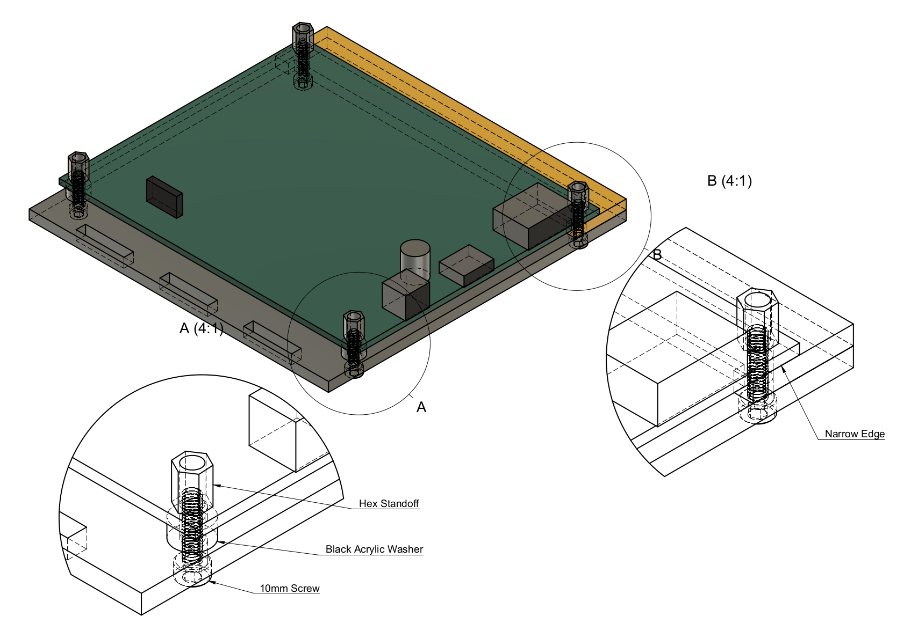
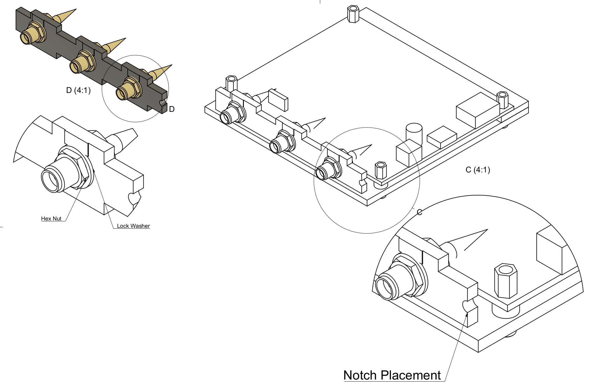
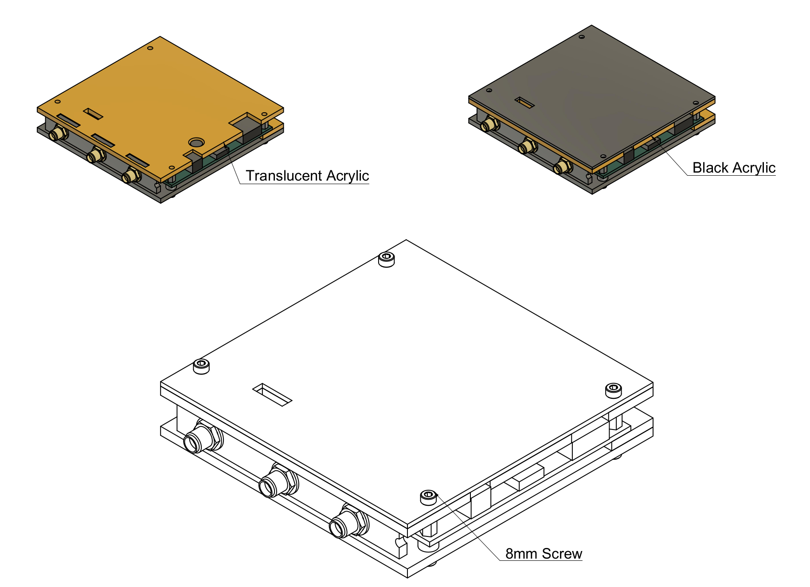

## Wi-Fi Pineapple Mk 7 Kismet Case

The Kismet Special Edition case for the [Hak5 Wi-Fi Pineapple MK7](https://shop.hak5.org/products/wifi-pineapple) helps support Kismet development and gives your Wi-Fi Pineapple an extra flair.

## Assembly Directions

### Step 1:  Disassemble the Pineapple MK7

1. Unscrew the 4 screws from the bottom of the Pineapple.  Two of them are underneath the rubber feet!
2. Gently pry the cover off.  To prevent damaging the plastic, use plastic tools if the cover doesn't release easily.
3. Unbolt the antennas from the sides of the case.  Be careful of the antenna cables, don't bend or pull them from the motherboard!

### Step 2:  Peel any masking off the acrylic

Some pieces of acrylic still have adhesive masking on them to protect them from scratches in shipment; peel any brown paper masking off the acrylic.

*Tip*: If you're having trouble getting the paper masking off, use a piece of duct tape or packing tape; it will come right off!

### Step 3:  Assemble the bottom of the case
{:width="640px"} [Zoom](mk7-case-step1.png)

Attach the MK7 motherboard to the bottom black acrylic (the one with no art), matte side out, using the 10mm (longer) screw.  Use the two black washers on the left-hand side and the yellow spacer on the right.

Note that one side of the yellow spacer is narrower than the other - the narrow side should be on the side with the ports on the MK7.

### Step 4:  Assemble the antenna panel
{:width="640px"} [zoom](mk7-case-step2.png)

Put the antennas through the antenna panel; they should be arranged so that the cables lie flat and curl with the original curl of the cabling.  Make sure not to stress the connection where the antenna cable connects to the motherboard, and don't crimp the cables excessively.

The matte side of the black antenna panel faces out, and the notch should be on the same side as the ports of the MK7 motherboard.

Be sure to screw the antennas down tightly using the lock washers!  You'll likely want to use a pair of pliers to get them tightly attached.  If they are too loose, attaching/removing the antennas will be difficult later, so make sure they're snug!  It's usually impossible to get them tight enough by finger tightening them alone.

### Step 5:  Assemble the top of the case
{:width="640px"} [Zoom](mk7-case-step3.png)

Place the transparent acrylic on top of the standoffs, and cover it with the black acrylic, matte/engraved side up.  Fasten it down with the 8mm (shorter) screws.

The washers around the antennas will fit into thin slots in the yellow layer, and all pieces should fit square and snug.

## Mechanical drawings

Want to make your own case?  Here's the model of the MK7 PCB used to create the Kismet case; it was modeled from measurements, so it may not be absolutely perfect.

Step and DXF files [available at GitHub](https://github.com/kismetwireless/cases/tree/main/hak5-pineapple-mk7)

## Tactical

Need to make your MK7 more tacti-cool?  Grab and 3d print a bottom plate for the Kismet acrylic case, or print an entire case; files [available at GitHub](https://github.com/kismetwireless/cases/tree/main/hak5-pineapple-mk7)
