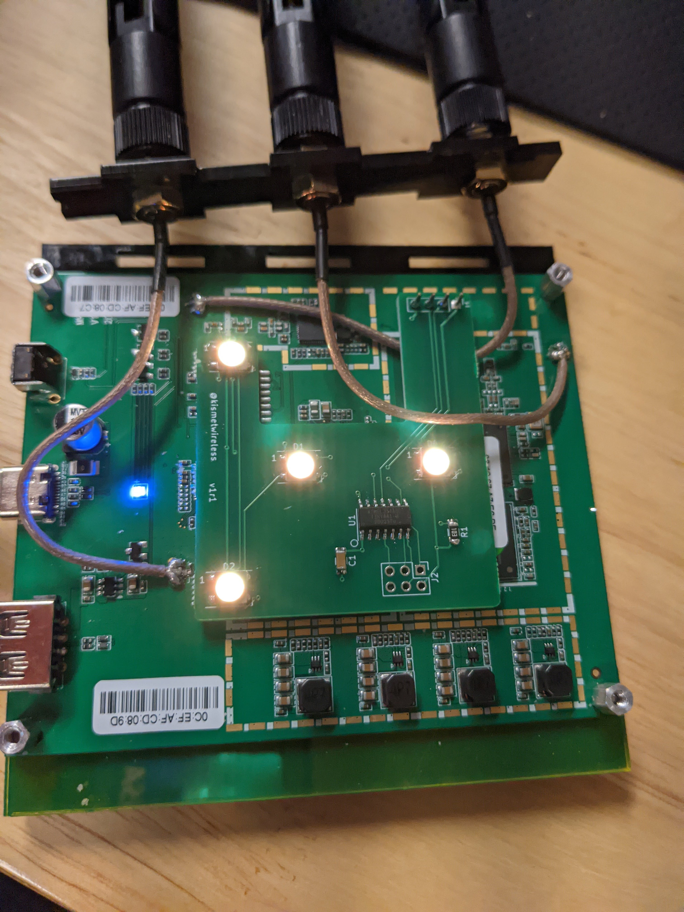

## Wi-Fi Pineapple Mk 7 LED Mod

The MK7 LED mod is an add-on board for the [Hak5 Wi-Fi Pineapple MK7](https://shop.hak5.org/products/wifi-pineapple) which adds some bling and fun LEDs.  Proceeds from the case help support Kismet development, too!

The LED mod is designed to work best with the [Kismet MK7 case](/mk7-kismet-case); with the normal black opaque case the LEDs won't be visible.

Installation of the LED mod requires very basic soldering skills.

## Assembly Directions

This assumes you've already disassembled the MK7 and have the board accessible.

1. Place the LED board so that the LEDs are facing up, and the 4 holes fit over the debug header on the MK7 PCB.

    {:width="300px"} [Zoom](ledmod.jpg)

2. Slightly tack down the board by soldering the 4 pins on the debug header.

    I recommend using a very small amount of solder to make it easier to remove the board in the future if so desired.

## Controlling the LEDs

The LEDs are controlled with the `LEDMK7` tool on the Pineapple.

You can:

* Change the speed of the pulsing of the LEDs

    ```
    # LEDMK7 -p 255
    ```

    To set the pulse speed even faster:

    ```
    # LEDMK7 -p 255,5
    ```

* Change the color of the pulsing LEDs

    The LED colors are defined as HSV (hue, saturation, value).  You can experiment with the values, or use colors from the [HSV color wheel](http://colorizer.org/).

    To pulse from a dim red to bright green:

    ```
    # LEDMK7 -a 30,200 -b 120,255
    ```

    To pulse bright green and only change the brightness:

    ```
    # LEDMK7 -a 120,255 -b 120,255
    ```

    Each pattern is set as a Hue (color, 0-360) and saturation (0-255).

* Set each LED to a specific color

    Each LED can be set to its own color and brightness.  Each LED is set to a Hue (color, 0-360), Saturation (0-255), and brightness (0-255).

    ```
    # LEDMK7 -0 30,255,255 -1 120,255,255 -2 300,255,255 -3 0,0,255
    ```

You can find more examples and detailed info with:

```
# LEDMK7 --help
```

## Reflashing the LED mod

The LED mod uses an attiny841, flashed with an Arduino bootloader.  It has a standard 6-pin AVR ISP header for programming.

Because of how the board is connected to the MK7, you *must* use a programmer which can be configured to flash without power.  You should *never* feed power into the MK7 via a programmer.  A [programmer like this](https://amzn.to/3ceBA0k) (Amazon affiliate link) will work fine.
